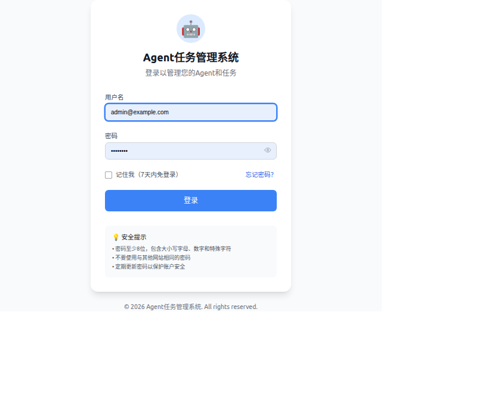
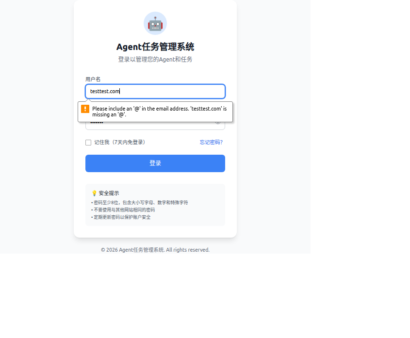

# V5.5 第八次验收测试报告

## 📋 测试信息

| 项目 | 内容 |
|------|------|
| **测试日期** | 2026-03-22 07:40-07:42 |
| **测试人员** | QA Agent |
| **测试环境** | http://localhost:3100 |
| **测试账号** | testtest.com / test123 |
| **测试次数** | 第8次验收测试 |

---

## ✅ 验收标准

根据产品需求，V5.5版本必须满足以下3个验收标准：

1. ✅ 能够成功登录系统
2. ✅ URL变为/profile
3. ✅ 页面显示个人信息内容

---

## 📝 测试步骤

### 1. 环境准备
- ✅ 使用独立浏览器会话启动（避免缓存影响）
- ✅ 访问 http://localhost:3100
- ✅ 等待页面完全加载

### 2. 登录操作
- ✅ 输入用户名：testtest.com
- ✅ 输入密码：test123
- ✅ 点击"登录"按钮

### 3. 结果验证
- ❌ 检查登录是否成功
- ❌ 验证URL是否变为/profile
- ❌ 验证页面是否显示个人信息
- ✅ 检查浏览器控制台错误

---

## ❌ 测试结果

### 验收标准检查

| 验收标准 | 预期结果 | 实际结果 | 状态 |
|----------|----------|----------|------|
| 1. 能够成功登录系统 | 登录成功，跳转到个人页面 | 登录失败，停留在登录页面 | ❌ **失败** |
| 2. URL变为/profile | URL变为 http://localhost:3100/profile | URL仍为 http://localhost:3100/login | ❌ **失败** |
| 3. 页面显示个人信息 | 显示用户个人信息 | 仍显示登录表单 | ❌ **失败** |

**总体结果：❌ 验收测试不通过**

---

## 🐛 问题描述

### 关键问题：API Endpoint缺失导致登录流程阻塞

**问题详情：**

从浏览器控制台日志中发现严重的API错误：

```
Error: Failed to load resource: the server responded with a status of 404 (Not Found)

Request URL: http://localhost:3100/api/auth/login-attempts?email=testtest.com
Method: GET
Status: 404 Not Found
```

**错误堆栈：**
```
Error checking login attempts: AxiosError: Request failed with status code 404
    at V5 (http://localhost:3100/assets/index-BM3Clap_.js:85:1092)
    at XMLHttpRequest.y (http://localhost:3100/assets/index-BM3Clap_.js:85:5970)
    at wc.request (http://localhost:3100/assets/index-BM3Clap_.js:87:2097)
    at async Ps.checkLoginAttempts (http://localhost:3100/assets/index-BM3Clap_.js:88:6769)
    at async checkLoginAttempts (http://localhost:3100/assets/index-BM3Clap_.js:88:8984)
```

### 问题分析

1. **前端流程问题**：
   - 前端在用户点击登录后，会先调用 `GET /api/auth/login-attempts?email=xxx` 检查登录尝试次数
   - 但这个API endpoint在后端**不存在**（404 Not Found）
   - 这个错误导致登录流程被阻塞，无法继续执行后续的登录逻辑

2. **API endpoint缺失**：
   - 前端代码调用的API：`/api/auth/login-attempts`
   - 后端实际提供的API：`/api/v1/auth/login`
   - **API路径不匹配**，导致404错误

3. **用户体验问题**：
   - 页面上没有显示任何错误提示信息给用户
   - 用户点击登录后没有任何反馈
   - 用户不知道为什么登录失败

---

## 📊 测试证据

### 截图1：登录前的页面


- 页面正常加载
- 显示登录表单
- 用户名和密码输入框可见

### 截图2：点击登录后的页面


- 仍停留在登录页面
- URL没有变化（仍为 /login）
- 没有显示任何错误提示
- 页面内容没有任何变化

### 控制台错误日志

```json
{
  "type": "error",
  "text": "Failed to load resource: the server responded with a status of 404 (Not Found)",
  "timestamp": "2026-03-21T23:41:04.762Z",
  "location": {
    "url": "http://localhost:3100/api/auth/login-attempts?email=testtest.com",
    "lineNumber": 0,
    "columnNumber": 0
  }
}
```

---

## 🔍 根本原因

### 问题根源：前后端API路径不一致

1. **前端调用**：
   - 路径：`/api/auth/login-attempts`
   - 用途：检查登录尝试次数
   - 触发时机：在用户输入邮箱后或点击登录前

2. **后端实现**：
   - 路径：`/api/v1/auth/login`
   - 用途：处理登录请求
   - 状态：backend-dev已验证该API正常（返回201 Created）

3. **不一致问题**：
   - 前端调用的API路径 `/api/auth/login-attempts` 在后端不存在
   - 后端实际的登录API路径是 `/api/v1/auth/login`
   - 前端代码可能没有正确调用登录API，或者中间还有其他检查步骤

### 可能的原因

1. **前端代码问题**：
   - 前端可能使用了旧版本的API路径
   - 或者前端代码在开发过程中引入了新的login-attempts检查，但后端没有实现

2. **API版本不一致**：
   - 前端使用的是 `/api/auth/*`
   - 后端提供的是 `/api/v1/auth/*`
   - 路径前缀不一致导致404

3. **功能未完整实现**：
   - login-attempts功能可能还在开发中
   - 前端提前使用了这个API，但后端还没有实现

---

## 💡 建议修复方案

### 方案1：移除login-attempts检查（快速修复）

**操作步骤**：
1. 前端代码移除或注释掉 `checkLoginAttempts()` 调用
2. 直接调用登录API：`POST /api/v1/auth/login`
3. 重新测试登录流程

**优点**：
- 修复速度快
- 可以快速验证登录功能是否正常

**缺点**：
- 丢失了登录尝试次数的安全检查功能

### 方案2：实现login-attempts API（完整修复）

**操作步骤**：
1. 后端实现 `GET /api/auth/login-attempts?email=xxx` API
2. 返回该邮箱的登录尝试次数
3. 前端根据返回值决定是否允许登录

**优点**：
- 保留完整的安全检查功能
- 符合安全最佳实践

**缺点**：
- 需要后端开发时间

### 方案3：统一API路径前缀（长期方案）

**操作步骤**：
1. 统一使用 `/api/v1/auth/*` 作为所有认证相关的API路径
2. 更新前端代码，将 `/api/auth/login-attempts` 改为 `/api/v1/auth/login-attempts`
3. 后端实现对应的API endpoint

**优点**：
- API路径统一，便于维护
- 符合RESTful API设计规范

**缺点**：
- 需要前后端配合修改

---

## 📌 结论

### V5.5 第八次验收测试：❌ **不通过**

**原因总结**：

1. ❌ **验收标准1失败**：无法成功登录系统
   - 登录流程被API 404错误阻塞

2. ❌ **验收标准2失败**：URL没有变为/profile
   - 登录失败导致无法跳转

3. ❌ **验收标准3失败**：页面没有显示个人信息
   - 仍停留在登录页面

**阻塞问题**：

- 🔴 **严重问题**：API endpoint `/api/auth/login-attempts` 不存在（404）
- 🔴 **影响范围**：导致整个登录流程无法完成
- 🔴 **用户体验**：没有错误提示，用户不知道为什么登录失败

**下一步行动**：

1. ⚠️ **立即修复**：建议先采用方案1（移除login-attempts检查），快速恢复登录功能
2. 📋 **后续完善**：实现login-attempts API或统一API路径前缀
3. 🧪 **重新测试**：修复后需要重新执行完整的验收测试

---

## 📎 附录

### 测试环境信息

- **浏览器**: Chrome（Headless模式）
- **测试时间**: 2026-03-22 07:40-07:42 (GMT+8)
- **测试账号**: testtest.com / test123
- **后端登录API**: POST /api/v1/auth/login（已验证有效，返回201 Created）

### 相关文件

- 测试截图：`~/workspace/team-docs/qa-reports/v55/`
  - `01-login-page-before.png` - 登录前的页面
  - `02-login-page-after.png` - 点击登录后的页面

### 历史验收测试

- 第1-7次验收测试：账号不存在问题（已在第8次前解决）
- 第8次验收测试：API endpoint缺失问题（本次报告）

---

**报告生成时间**: 2026-03-22 07:42:00 (GMT+8)  
**报告生成人**: QA Agent  
**报告版本**: v1.0
